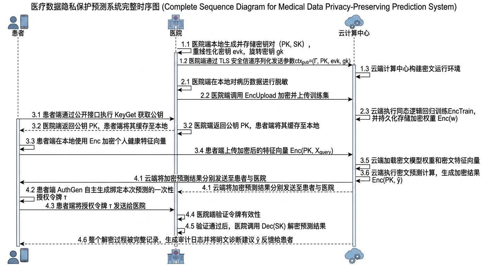
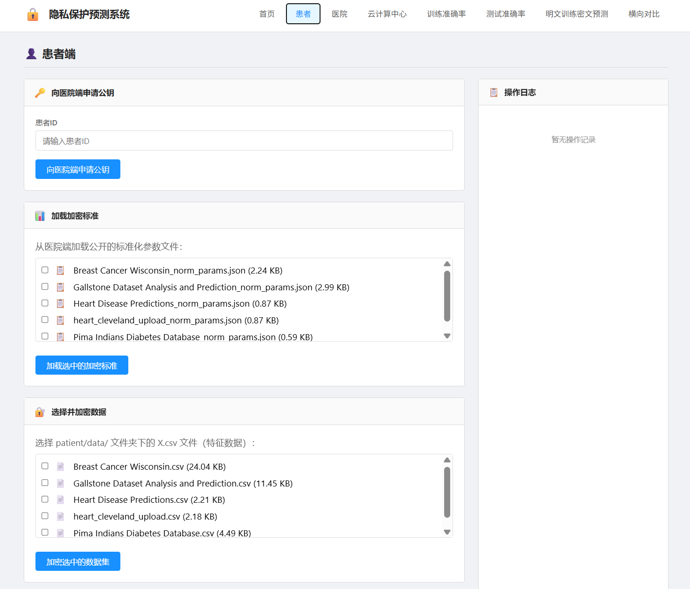
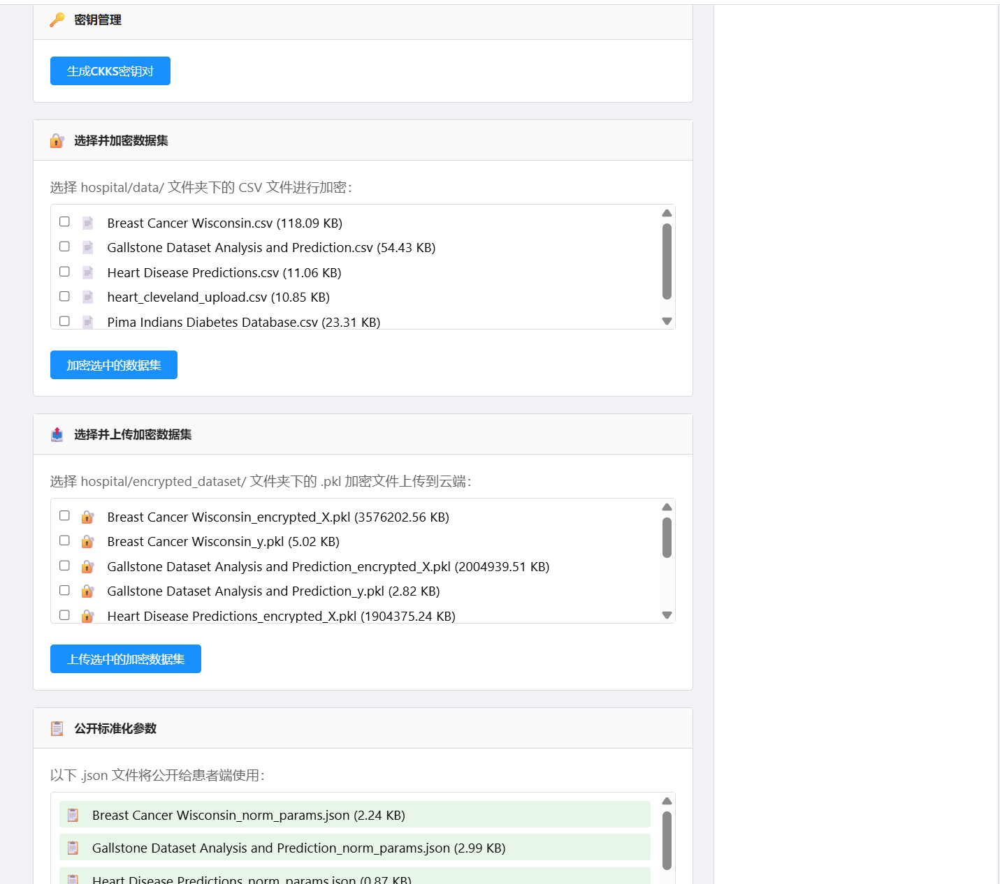
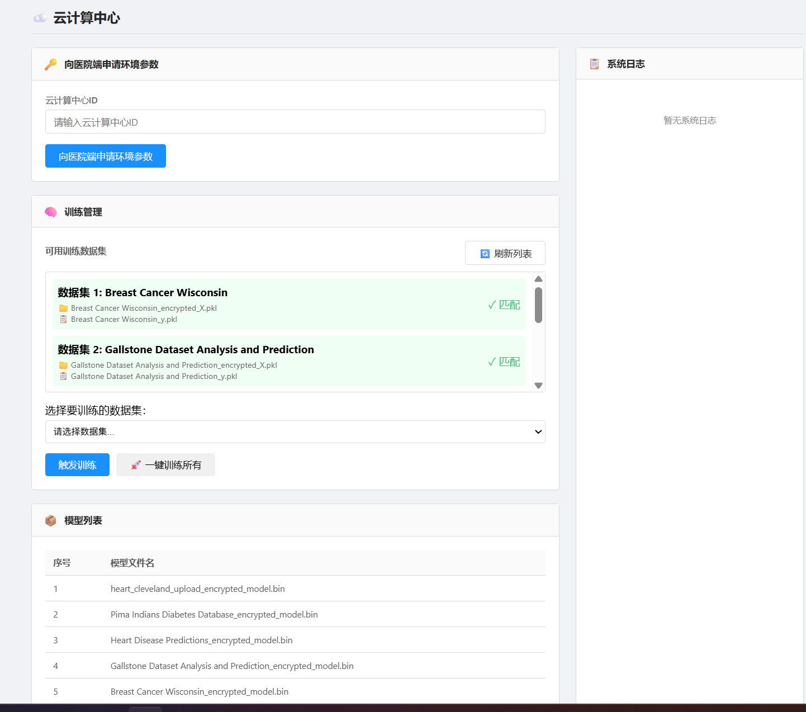
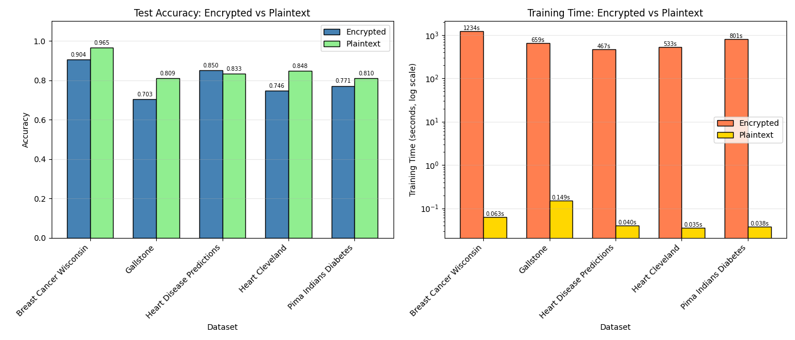

# 基于同态加密的医疗数据隐私保护预测系统

[](https://opensource.org/licenses/MIT)
[](https://www.python.org/downloads/)
[](https://github.com/OpenMined/TenSEAL)

> 基于CKKS层次同态加密技术，实现医疗数据隐私保护前提下的逻辑回归预测系统。

## 📋 目录

- [项目概述](#项目概述)
- [核心特性](#核心特性)
- [系统架构](#系统架构)
- [技术亮点](#技术亮点)
- [实验结果](#实验结果)
- [快速开始](#快速开始)
- [项目结构](#项目结构)
- [使用指南](#使用指南)
- [相关技术](#相关技术)

## 📖 项目概述

医疗数据包含患者的高度敏感信息，将其外包至云计算中心进行机器学习训练与推理时，面临着严峻的隐私泄露风险。本项目基于CKKS（Cheon-Kim-Kim-Song）层次同态加密方案，设计并实现了一个医疗数据隐私保护预测系统。

**核心思想：** 实现"数据可用不可见"——数据全程以加密状态存储和计算，云端无法接触任何明文信息，只有数据所有者（患者）授权后，医院才能解密预测结果。

## ✨ 核心特性

### 🔐 隐私保护
- **数据全程加密**：原始数据从未离开患者/医院
- **云端无解密能力**：云端仅执行密文运算，无法解密
- **授权解密机制**：患者自主控制预测结果的解密权限
- **审计日志**：所有解密操作全程记录，可追溯

### 🎯 算法优化
- **分块Nesterov加速梯度下降**：将训练集等分为少量数据块，每轮仅用一个块完成梯度计算
- **3次极小极大多项式近似Sigmoid**：在[-5,5]区间内最大绝对误差控制在约0.02
- **无自举轻量级训练**：在普通笔记本上实现分钟级全密文训练

### 🏗️ 系统架构
- **三方协同架构**：患者端、医院端、云计算中心各司其职
- **Web可视化界面**：提供友好的用户操作界面
- **多数据集支持**：内置5个UCI医疗数据集

## 🏗️ 系统架构

```
┌─────────────────┐          ┌─────────────────┐          ┌─────────────────┐
│    患者端       │          │    医院端       │          │  云计算中心     │
│   (Patient)     │◄────────►│   (Hospital)    │◄────────►│    (Cloud)      │
└─────────────────┘          └─────────────────┘          └─────────────────┘
         │                              │                              │
         │ 1. 申请公钥                  │                              │
         ├─────────────────────────────►│                              │
         │                              │                              │
         │ 2. 获取公钥                  │                              │
         │◄─────────────────────────────┤                              │
         │                              │                              │
         │ 3. 加密个人数据              │                              │
         │                              │                              │
         │ 4. 发送加密查询              │                              │
         ├────────────────────────────────────────────────────────────►│
         │                              │                              │
         │                              │ 5. 密文训练/预测              │
         │                              │◄─────────────────────────────┤
         │                              │                              │
         │ 6. 返回加密结果              │                              │
         │◄────────────────────────────────────────────────────────────┤
         │                              │                              │
         │ 7. 申请解密                  │                              │
         ├─────────────────────────────►│                              │
         │                              │                              │
         │ 8. 解密结果                  │                              │
         │◄─────────────────────────────┤                              │
```

### 系统流程图

下图展示了本系统的整体工作流程：



### 系统界面展示

本系统提供友好的Web可视化界面，包含患者端、医院端和云计算中心三个操作界面：

#### 患者端界面


#### 医院端界面


#### 云计算中心界面


### 角色职责

| 角色 | 职责 | 核心功能 |
|------|------|----------|
| **患者端** | 数据提供者与预测请求发起者 | 公钥申请、数据加密、预测请求、授权令牌生成 |
| **医院端** | 训练数据源、密钥管理者与解密服务方 | 密钥生成、训练数据加密、授权解密 |
| **云计算中心** | 受托密文计算与存储节点 | 密文训练、密文预测、加密模型存储 |

## 🚀 技术亮点

### CKKS同态加密参数

| 参数 | 配置值 | 说明 |
|------|--------|------|
| 多项式次数 N | 32768 | 提供16384个明文槽位 |
| 模数链总比特数 | 760 bits | 支持约25-30次重缩放操作 |
| 缩放因子 Δ | 2^25 | 与重缩放约减因子一致 |
| 安全等级 | >128-bit | 基于RLWE困难问题 |

### 算法设计

#### 分块Nesterov加速梯度下降

```
算法亮点：
├── 将训练集等分为少量数据块
├── 每轮仅使用一个块完成梯度计算与参数更新
├── 大幅压缩所需同态乘法次数和模数链深度
└── 仅需3轮迭代即可获得可用模型
```

#### Sigmoid多项式近似

采用3次极小极大多项式近似：

```
P(z) = 0.5 + 0.15012·z - 0.0015936·z³
区间：[-5, 5]
最大绝对误差：≈0.02
乘法深度：3层
```

### 乘法深度分析

| 操作 | 深度消耗 |
|------|----------|
| 密文内积（dot） | 1层 |
| Sigmoid近似 | 3层 |
| 梯度计算 | 1层 |
| 参数更新（含动量） | 2层 |
| **总计** | **约7-8层** |

## 📊 实验结果

### 实验环境

#### 硬件配置

| 类别 | 配置 |
|------|------|
| CPU 型号 | Intel Core i7-13700H |
| 核心数量和频率 | 14核20线程，最高5.0GHz |
| 内存大小与频率 | 32GB，DDR5 |

#### 软件配置

| 类别 | 配置 |
|------|------|
| 操作系统 | Windows 11 |
| 集成开发环境 | Visual Studio Code 1.97.0 (user setup) |
| 解释器版本 | Python 3.10 |
| 核心库版本 | TenSEAL 0.3.10, scikit-learn 1.2.2, NumPy 1.25.2, pandas 1.5.3, matplotlib 3.10.1 |

### 性能指标

在5个UCI医疗数据集上的实验结果：

| 数据集 | 样本数 | 特征数 | 密文准确率 | 明文准确率 | 密文训练时间(s) | 明文训练时间(s) | 预测耗时(s) |
|--------|--------|--------|------------|------------|-----------------|-----------------|-------------|
| Breast Cancer Wisconsin | 569 | 31 | 0.9042 | 0.9646 | 1264.10 | 0.063 | 0.39 |
| Gallstone | 319 | 39 | 0.7032 | 0.8095 | 658.90 | 0.149 | 0.35 |
| Heart Disease Predictions | 303 | 14 | 0.8500 | 0.8333 | 466.54 | 0.040 | 0.21 |
| Heart Cleveland | 297 | 14 | 0.7458 | 0.8475 | 532.55 | 0.035 | 0.24 |
| Pima Indians Diabetes | 768 | 9 | 0.7712 | 0.8105 | 801.03 | 0.038 | 0.27 |

### 准确率与训练时长对比

下图展示了不同数据集上的密文准确率与明文准确率对比，以及密文训练时长与明文训练时长的对比：



### 方案对比

| 对比维度 | 明文训练+密文预测 | Kim等方案【21】 | 本方案 |
|----------|------------------|----------------|--------|
| 训练数据形式 | 明文 | 密文（CKKS） | 密文（CKKS） |
| 训练轮数 | 20+ | 20~25轮 | **3轮** |
| Sigmoid近似 | 精确计算+多项式 | 最小二乘(3/7阶) | 3次极小极大 |
| 梯度优化 | 标准GD | Nesterov加速 | **分块Nesterov加速** |
| SIMD批处理 | 支持 | 支持 | 不支持（逐样本） |
| 自举操作 | 不需要 | 不需要 | **不需要** |
| CKKS参数 | N=8192 | N=131072 | **N=32768** |
| 安全等级 | >128-bit | 80-bit | **>128-bit** |
| 模型机密性 | 暴露于云端 | IND-CPA安全 | **IND-CPA安全** |
| 准确率损失 | <0.1% | <1% | **多数<6%** |
| 训练耗时 | 秒级 | 小时级 | **分钟级** |
| 硬件要求 | 低 | 高 | **中** |
| 部署复杂度 | 极低 | 高 | **低** |

## 🏁 快速开始

### 环境要求

- Python 3.10+
- 操作系统：Windows 10+/Linux/macOS
- 内存：建议16GB+

### 安装依赖

```bash
# 克隆项目
git clone https://github.com/your-username/ckks-medical-privacy.git
cd ckks-medical-privacy

# 安装依赖
pip install -r requirements.txt
```

### 运行系统

```bash
# 启动Web服务
python app.py

# 访问系统
# 打开浏览器访问：http://127.0.0.1:5000
```

## 📁 项目结构

```
CKKS_Logistic_regression_Medical_data_privacy_prediction/
├── app.py                      # Flask主应用入口
├── requirements.txt            # Python依赖列表
├── README.md                   # 项目说明文档
│
├── hospital/                   # 医院端模块
│   ├── keygen.py              # CKKS密钥生成
│   ├── encrypt_dataset.py     # 训练数据加密
│   ├── decrypt_prediction.py   # 预测结果解密
│   ├── routes.py              # 医院端API路由
│   ├── data/                  # 原始训练数据
│   │   ├── train_data/        # 训练数据集
│   │   └── test_data/         # 测试数据集
│   ├── encrypted_dataset/      # 加密训练数据
│   └── keys/                  # 密钥存储目录
│
├── patient/                    # 患者端模块
│   ├── encrypt_query.py       # 查询数据加密
│   ├── routes.py              # 患者端API路由
│   ├── data/                  # 患者数据
│   └── keys/                  # 公钥缓存
│
├── cloud/                     # 云计算中心模块
│   ├── encrypted_train.py     # 密文训练算法
│   ├── encrypted_predict.py   # 密文预测算法
│   ├── routes.py              # 云端API路由
│   ├── encrypted_dataset/      # 加密训练数据存储
│   ├── encrypted_models/       # 加密模型存储
│   ├── encrypted_predictions/  # 加密预测结果
│   └── keys/                  # 公开运算上下文
│
├── utils/                     # 工具模块
│   ├── ckks_utils.py         # CKKS工具函数
│   ├── homomorphic_lr.py     # 同态逻辑回归实现
│   └── auth_utils.py         # 授权令牌工具
│
├── templates/                 # Web模板
│   └── index.html             # 主界面
│
└── static/                    # 静态资源
    ├── css/
    │   └── style.css
    └── js/
        └── app.js
```

## 💻 使用指南

### 1. 医院端操作流程

1. **生成CKKS密钥**
   - 点击"生成密钥对"按钮
   - 系统自动生成公钥、私钥、重线性化密钥和旋转密钥

2. **加密训练数据**
   - 选择数据集文件
   - 点击"加密选中的数据集"
   - 系统完成数据标准化和CKKS加密

3. **上传加密数据至云端**
   - 选择加密后的数据集文件
   - 点击"上传选中的加密数据到云端"

4. **解密预测结果**
   - 查看患者解密申请列表
   - 验证授权后点击"解密预测结果"

### 2. 患者端操作流程

1. **申请公钥**
   - 输入患者ID
   - 点击"向医院端申请公钥"

2. **加载加密标准**
   - 从医院端获取标准化参数文件

3. **加密查询数据**
   - 选择个人健康数据CSV文件
   - 点击"加密选中的文件"

4. **发起预测请求**
   - 输入请求ID和患者ID
   - 选择模型
   - 点击"发送预测请求"

5. **申请解密结果**
   - 输入患者ID、预测ID
   - 选择模型
   - 点击"向医院端申请解密"

### 3. 云计算中心操作流程

1. **加载医院端公钥**
   - 点击"加载医院端公钥"

2. **训练加密模型**
   - 选择数据集
   - 点击"触发训练"或"一键训练所有"

3. **处理预测请求**
   - 查看预测请求列表
   - 选择请求并执行预测

## 📚 相关技术

- **同态加密库**：[TenSEAL](https://github.com/OpenMined/TenSEAL) - 微软开源的同态加密库
- **Web框架**：[Flask](https://flask.palletsprojects.com/) - 轻量级Web框架
- **机器学习**：[scikit-learn](https://scikit-learn.org/) - 机器学习工具库
- **数值计算**：[NumPy](https://numpy.org/) - 科学计算库

## 🔬 引用

本项目主要基于以下工作：

1. **CKKS同态加密方案**：Cheon, J. H., Kim, A., Kim, M., & Song, Y. (2017). Homomorphic encryption for arithmetic of approximate numbers. ASIACRYPT 2017.
2. **Nesterov加速梯度**：Nesterov, Y. (1983). A method for solving the convex programming problem with convergence rate O(1/k²). Soviet Mathematics Doklady.
3. **同态逻辑回归**：Kim, M., et al. (2018). Logistic regression on homomorphic encrypted data. Privacy Enhancing Technologies.

## 📄 许可证

本项目采用 MIT 许可证 - 详见 [LICENSE](LICENSE) 文件

---

**⚠️ 注意**：本项目仅用于学术研究和学习目的，请勿直接用于生产环境。医疗数据隐私保护需要更严格的安全审计和合规认证。
## 📝 项目声明

- **项目名称**：基于同态加密的医疗数据隐私保护预测系统
- **开发语言**：Python
- **框架**：Flask
- **核心技术**：CKKS同态加密、Nesterov加速梯度下降、Sigmoid多项式近似、隐私保护机器学习
