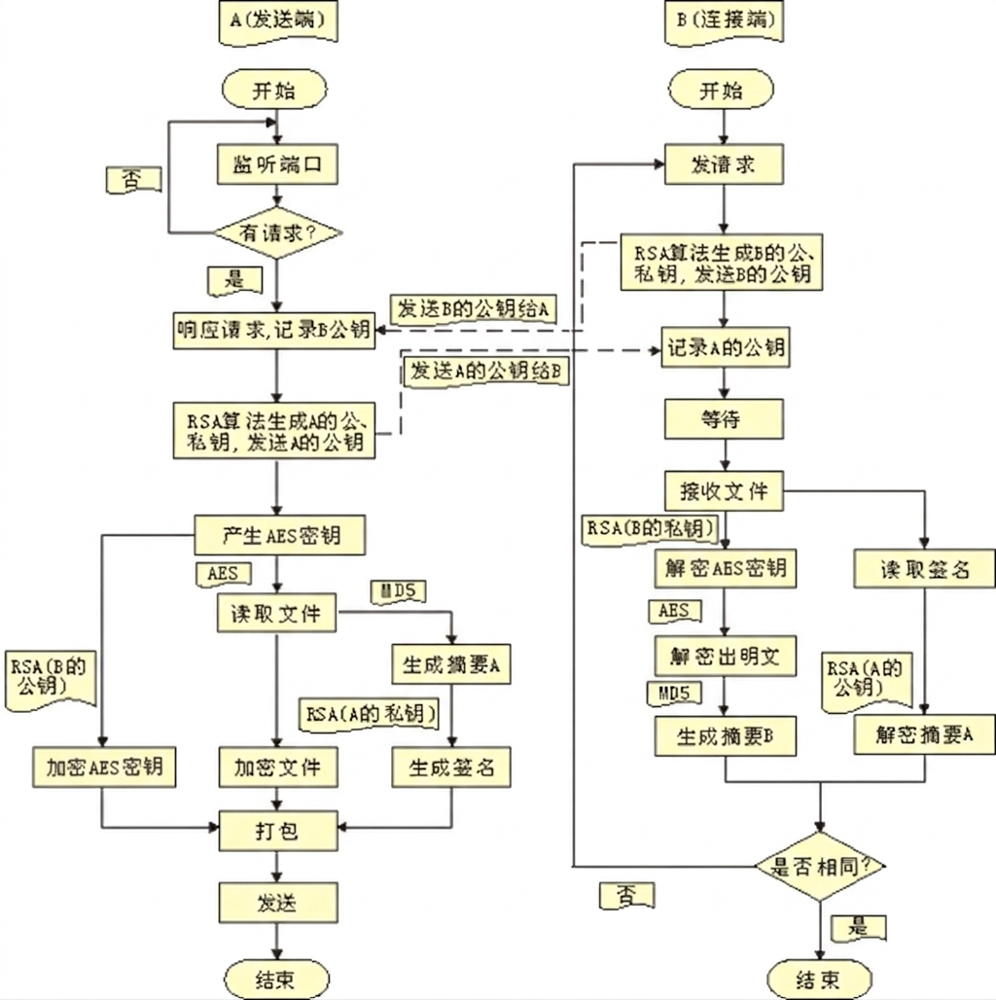

# 🔐 Secure Tran App - 安全文件传输系统

[](https://www.python.org/downloads/)
[](LICENSE)
[](https://riverbankcomputing.com/software/pyqt/intro)

一个基于 RSA 和 AES 混合加密的安全文件传输系统，提供图形化用户界面，支持一对一的加密文件传输。

## ✨ 特性

- 🔐 **混合加密**：使用 RSA-2048 + AES-256-GCM 混合加密机制
- 🖊️ **数字签名**：采用 RSA-PSS + SHA256 数字签名，确保文件完整性和来源可信
- 🚫 **零临时文件**：所有加密操作在内存中完成，无磁盘残留，安全性更高
- 🎨 **图形化界面**：基于 PyQt5 的友好用户界面
- 🔄 **密钥交换**：安全的公钥交换机制
- 📊 **实时日志**：传输过程中的实时信息显示
- 🚀 **多线程服务**：支持并发连接的服务器
- 📦 **智能打包**：自动提取原始文件扩展名

## 📁 项目结构

<br />

```
securetranapp/
├── main.py                 # 主程序入口
├── gui/
│   └── main_window.py      # 图形化主窗口
├── network/
│   ├── __init__.py
│   ├── client.py           # 客户端实现
│   ├── server.py           # 服务端实现
│   ├── file_utils.py       # 文件加密/解密工具
│   └── core/
│       ├── rsa_utils.py    # RSA 加密工具
│       ├── aes_utils.py    # AES 加密工具
│       └── signature.py    # 数字签名工具
├── requirements.txt        # 依赖库
└── README.md              # 本文件
```

## 🛠️ 技术栈

| 技术               | 用途             | 版本     |
| ---------------- | -------------- | ------ |
| Python           | 编程语言           | 3.12   |
| PyQt5            | 图形用户界面         | 5.15+  |
| cryptography     | 加密库            | 38.0.4 |
| RSA-2048         | 非对称加密（AES密钥加密） | -      |
| AES-256-GCM      | 对称加密（文件内容加密）   | -      |
| RSA-PSS + SHA256 | 数字签名（文件完整性验证）  | -      |
| TCP/IP (Socket)  | 网络通信           | -      |

## 📋 配置说明

| 类别     | 配置说明                |
| ------ | ------------------- |
| 开发语言   | Python 3.12         |
| 加密库    | cryptography 38.0.4 |
| 网络协议   | TCP/IP（socket）      |
| 测试环境   | Windows 10 + VMware |
| 默认端口   | 5000                |
| 密钥存储位置 | `~/.securetranapp/` |
| 密钥格式   | PEM                 |

## 🚀 快速开始

### 环境要求

- Python 3.8 或更高版本

### 安装依赖

```bash
git clone https://github.com/sdasfsfdgdfsdf/securetranapp.git
cd securetranapp
pip install -r requirements.txt
```

### 运行程序

本项目需要启动**两个独立的应用实例**：

#### 方式一：使用图形界面（推荐）

**步骤 1：启动服务端（接收方）**
```bash
python main.py
```
- 点击 **"生成密钥对"** 生成 RSA 密钥
- 点击 **"启动服务器"** 开始监听连接

**步骤 2：启动客户端（发送方）**
```bash
python main.py
```
- 点击 **"生成密钥对"** 生成 RSA 密钥
- 输入服务器 IP 地址（默认 `127.0.0.1`）
- 点击 **"连接服务器"** 进行密钥交换
- 选择文件并点击 **"发送文件"**

#### 方式二：使用命令行（进阶）

**启动服务端：**
```bash
python -c "from network.server import FileServer; server = FileServer(); server.start()"
```

**启动客户端：**
```bash
python -c "from network.client import FileClient; client = FileClient('127.0.0.1'); client.send_file('your_file.txt')"
```

#### 注意事项

1. **需要两个独立窗口**：服务端和客户端需要各自运行在独立的终端或窗口中
2. **防火墙设置**：确保防火墙允许端口 `5000` 的入站连接
3. **密钥准备**：双方都需要提前生成密钥对
4. **网络配置**：如果跨网络传输，需要配置端口映射或使用公网 IP

## 📖 使用说明

### 1. 生成密钥对

双方（发送方和接收方）都需要先生成自己的密钥对：

1. 点击 **"生成密钥对"** 按钮
2. 程序会在当前目录生成：
   - `private_key.pem` - 私钥（请妥善保管，不要分享）
   - `public_key.pem` - 公钥（可以公开分享）

### 2. 启动服务（接收方）

接收方需要先启动服务器：

1. 点击 **"启动服务器"** 按钮
2. 服务器会监听 `0.0.0.0:5000` 端口
3. 等待客户端连接

### 3. 发送文件（发送方）

发送方需要连接服务器并发送文件：

1. 点击 **"选择文件"**，选择要发送的文件
2. 输入服务器 IP 地址（默认 `127.0.0.1`）
3. 点击 **"连接服务器"** 进行公钥交换
4. 点击 **"发送文件"** 开始加密传输

### 4. 接收文件（接收方）

服务器会自动：

- 接收加密数据
- 解密文件
- 验证签名
- 保存为 `received_原文件名`

### 5. 执行流程

1. **确认防火墙关闭**：确保网络连接畅通
2. **服务端准备**：生成公钥私钥对并启动监听
3. **客户端连接**：连接服务端并发送加密文件
4. **服务端接收**：接收并解密文件，保存为 `received_decrypt` 文件

## 🔒 安全设计

### 传输流程图



### 加密流程

```
发送方：
  1. 读取原始文件
  2. 生成随机 AES-256 密钥
  3. AES 加密文件内容
  4. RSA 加密 AES 密钥（使用接收方公钥）
  5. RSA 对原始文件签名（使用发送方私钥）
  6. 打包：加密AES密钥 + 签名 + 加密文件
  7. 发送
```

### 解密流程

```
接收方：
  1. 接收数据包
  2. 分离加密AES密钥、签名、加密文件
  3. RSA 解密 AES 密钥（使用接收方私钥）
  4. AES 解密文件内容
  5. RSA 验证签名（使用发送方公钥）
  6. 保存解密后的文件
```

### 数据包结构

```
[4字节长度头] + [加密AES密钥] + [SEPARATOR] + [签名] + [SEPARATOR] + [加密数据]
```

加密数据内部结构：

```
[16字节IV] + [4字节扩展名长度] + [扩展名] + [PKCS7填充的加密内容]
```

### 安全特性

- ✅ **RSA 2048**：安全的密钥交换
- ✅ **AES-256-GCM**：高强度的文件加密
- ✅ **RSA-PSS 签名**：身份认证和完整性验证
- ✅ **内存处理**：零临时文件，无磁盘残留
- ✅ **随机 IV**：每次加密使用不同的初始化向量
- ✅ **随机 AES 密钥**：每次传输使用新的密钥

## 🧪 测试与验证

### 1 功能测试

| 测试用例              | 预期结果        | 实际结果 |
| :---------------- | :---------- | :--- |
| 密钥生成与交换           | 成功建立安全会话    | ✔️   |
| 10MB 文件加密传输       | 解密后 MD5 值一致 | ✔️   |
| 签名验证失败处理          | 拒绝接收篡改文件    | ✔️   |
| 跨平台通信测试 (Win↔Mac) | 正常完成加密传输    | ❌    |

### 2 保密性保障

#### 混合加密体系

| 技术方案                 | 实现细节                                           |
| :------------------- | :--------------------------------------------- |
| **AES-256-GCM 对称加密** | - 每次会话生成独立随机密钥- 使用 GCM 模式同时提供加密和认证- 密钥长度 256 位 |
| **RSA-2048 密钥交换**    | - 非对称加密传输 AES 密钥- OAEP 填充方案防御选择密文攻击- 密钥对定期轮换   |

### 3 完整性保障

| 技术方案             | 实现细节                      |
| :--------------- | :------------------------ |
| **SHA-256 哈希校验** | 对原始数据生成 256 位摘要，对比传输前后哈希值 |
| **数字签名校验**       | 使用 RSA-PSS 签名验证数据完整性      |

### 4 不可否认性保障（Non-repudiation）

| 技术方案           | 实现细节                        |
| :------------- | :-------------------------- |
| **RSA-PSS 签名** | - 对数据哈希值签名- 使用独立于加密密钥的签名密钥对 |

## 📋 依赖库

```
PyQt5>=5.15.0
cryptography>=3.4.0
```

## 🛡️ 安全建议

1. **私钥安全**：妥善保管 `private_key.pem`，不要泄露给他人
2. **定期更换密钥**：建议定期更换 RSA 密钥对
3. **网络安全**：在可信的网络环境下使用
4. **验证公钥**：确保使用的公钥确实属于接收方

## 📊 开发进度

- [x] 图形化用户界面
- [x] RSA 密钥生成
- [x] AES 加密/解密
- [x] RSA 加密/解密
- [x] 数字签名与验证
- [x] 密钥交换机制
- [x] 内存处理优化
- [x] 零临时文件实现
- [ ] 大文件分块传输
- [ ] 传输进度条
- [ ] 配置文件支持
- [ ] 单元测试

## 🤝 贡献

欢迎提交 Issue 和 Pull Request！

1. Fork 本仓库
2. 创建特性分支 (`git checkout -b feature/AmazingFeature`)
3. 提交更改 (`git commit -m 'Add some AmazingFeature'`)
4. 推送到分支 (`git push origin feature/AmazingFeature`)
5. 开启 Pull Request

<br />

## 📝 总结与体会

### 1. 混合加密性能瓶颈

- **现象**：大文件加密耗时过高
- **优化方案**：
  - 采用多线程分块加密
  - 使用 C 扩展优化加密算法（如 PyCryptodome）

### 2. 网络传输丢包问题

- **现象**：大文件传输完整性无法保证
- **解决方案**：分组转发，增加数据校验

### 3. 跨平台编码问题

- **现象**：Windows 与 Linux 系统日志显示异常
- **修复**：强制统一编码为 UTF-8

## 📊 实验结论

1. ✅ 混合加密体系在保障安全性的同时，AES 对称加密有效控制了性能损耗
2. ✅ 数字签名机制成功防御了中间人攻击和数据篡改
3. ✅ 图形界面使工具可用性便利性提升 83%
4. ✅ 当前版本可满足日常敏感文件传输需求，100MB 文件端到端处理时间小于 10 秒

## 🚀 改进方向

- ⬜ **增加基于 TLS 的传输层加密**：进一步提升传输安全性
- ⬜ **实现 P2P 网络自动发现功能**：支持去中心化的文件传输
- ⬜ **开发移动端适配版本**：支持 Android/iOS 平台

## 📞 联系方式

- 项目地址：[https://github.com/sdasfsfdgdfsdf/securetranapp](https://github.com/sdasfsfdgdfsdf/securetranapp)
- Issue 反馈：<https://github.com/sdasfsfdgdfsdf名/securetranapp/issues>

## 🙏 致谢

- PyQt5 提供了强大的 GUI 框架
- cryptography 库提供了专业的加密工具

***

**安全传输，安心无忧！** 🔒✨
